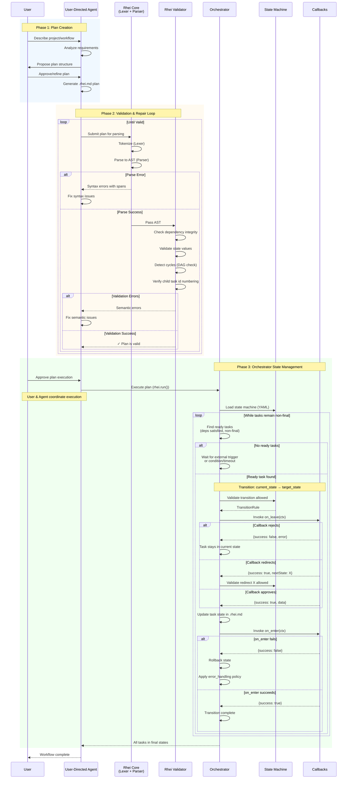

# AR-agent-orchestrator-workflow: Agent-Orchestrator Workflow Architecture

This document describes how a user-directed agent creates a Rhei plan, validates
and fixes syntax, and passes it to the orchestrator for state-managed execution.
It expands the plan language, state machine, transition, and run-command
contracts into the component workflow they imply. [§FS-rhei-plan-language](../functional-spec/rhei-plan-language.spec.md#fs-rhei-plan-language-rhei-plan-language-specification)
[§FS-rhei-states](../functional-spec/rhei-states.spec.md#fs-rhei-states-rhei-states-specification) [§FS-rhei-transitions](../functional-spec/rhei-transitions.spec.md#fs-rhei-transitions-rhei-transitions-specification) [§FS-rhei-run](../functional-spec/rhei-run.spec.md#fs-rhei-run-rhei-run) [§FS-rhei-agents](../functional-spec/rhei-agents.spec.md#fs-rhei-agents-rhei-agents-specification)

## 1. High-Level Architecture

```
┌─────────────────────────────────────────────────────────────────────────────────────┐
│                              USER-DIRECTED AGENT                                     │
│  ┌─────────────┐    ┌──────────────────┐    ┌──────────────────┐                   │
│  │   User      │───▶│  Agent (e.g.,    │───▶│  Generate Rhei   │                   │
│  │   Request   │    │  Claude/Kilo)    │    │  Plan (.rhei.md) │                   │
│  └─────────────┘    └──────────────────┘    └────────┬─────────┘                   │
└────────────────────────────────────────────────────────┼───────────────────────────┘
                                                         │
                                                         ▼
┌─────────────────────────────────────────────────────────────────────────────────────┐
│                           SYNTAX VALIDATION & REPAIR LOOP                           │
│                                                                                     │
│  ┌──────────────┐    ┌──────────────────┐    ┌──────────────────┐                  │
│  │  rhei-core   │───▶│  rhei-validator  │───▶│  Validation      │                  │
│  │  (Lexer +    │    │  (Semantic       │    │  Result          │                  │
│  │   Parser)    │    │   Checks)        │    │                  │                  │
│  └──────────────┘    └──────────────────┘    └────────┬─────────┘                  │
│         ▲                                             │                            │
│         │            ┌──────────────────┐             │                            │
│         └────────────│  Agent Fixes     │◀────────────┘                            │
│           (if errors)│  Syntax Errors   │    (errors returned)                     │
│                      └──────────────────┘                                          │
└────────────────────────────────────────────────────────────────────────────────────┘
                                                         │
                                                         │ (valid AST)
                                                         ▼
┌─────────────────────────────────────────────────────────────────────────────────────┐
│                               ORCHESTRATOR ENGINE                                    │
│                                                                                     │
│  ┌──────────────────────────────────────────────────────────────────────────────┐  │
│  │                         State Machine (YAML)                                  │  │
│  │  ┌─────────┐    ┌─────────────┐    ┌─────────┐    ┌───────────┐              │  │
│  │  │ pending │───▶│ in-progress │───▶│ review  │───▶│ completed │              │  │
│  │  └─────────┘    └─────────────┘    └─────────┘    └───────────┘              │  │
│  └──────────────────────────────────────────────────────────────────────────────┘  │
│                                                                                     │
│  ┌──────────────────────────────────────────────────────────────────────────────┐  │
│  │                    Transition Management                                      │  │
│  │                                                                               │  │
│  │   1. Find ready tasks (dependencies satisfied)                               │  │
│  │   2. Trigger on_leave callback                                               │  │
│  │   3. Update task state in .rhei.md                                           │  │
│  │   4. Trigger on_enter callback                                               │  │
│  │   5. Handle callback results (success/redirect/reject)                       │  │
│  │   6. Loop until all tasks reach final states                                 │  │
│  │                                                                               │  │
│  └──────────────────────────────────────────────────────────────────────────────┘  │
└─────────────────────────────────────────────────────────────────────────────────────┘
```

---

## 2. Detailed Sequence Diagram



---

## 3. Component Responsibilities

### 3.1. User-Directed Agent

The agent (e.g., a coding assistant like Claude) interprets user intent and generates structured plans:

| Responsibility | Description |
|----------------|-------------|
| **Interpret Requirements** | Understand user's project goals and constraints |
| **Generate Plan** | Create a `.rhei.md` file following the [Plan Language Specification](../functional-spec/rhei-plan-language.spec.md) |
| **Fix Errors** | Iteratively correct syntax and semantic errors until validation passes |
| **Monitor Progress** | Track task completion and adjust plans as needed |

### 3.2. Validation Pipeline

The validation pipeline ensures plan correctness before execution:

```
┌─────────────────────────────────────────────────────────────────┐
│                      rhei-core                                   │
├─────────────────────────────────────────────────────────────────┤
│  Lexer (lexer.rs)                                               │
│  ├── Tokenizes markdown into structured tokens                  │
│  ├── Identifies: RheiHeader, TaskHeader, MetadataState, etc.   │
│  └── Produces token stream with span information                │
│                                                                  │
│  Parser (parser.rs)                                              │
│  ├── Consumes token stream                                       │
│  ├── Builds AST (Plan → recursive Task tree)                    │
│  └── Reports parse errors with line/column info                 │
└─────────────────────────────────────────────────────────────────┘
                              │
                              ▼
┌─────────────────────────────────────────────────────────────────┐
│                    rhei-validator                                │
├─────────────────────────────────────────────────────────────────┤
│  Semantic Checks:                                                │
│  ├── Dependency integrity (all Prior refs exist)                │
│  ├── State validity (states match states.yaml)                  │
│  ├── Acyclic check (DAG via topological sort)                   │
│  └── Child task ids (Task N.M under Task N; depth ≤ maxLevels)  │
└─────────────────────────────────────────────────────────────────┘
```

### 3.3. Orchestrator Engine

The task scheduler cannot spawn provider-capable work directly. Every agent,
model-capable program/callback, fanout arm, retry, poll, supervisor wake-up and
nested execution crosses §AR-neural-admission, which durably reserves the
composable bounds of §REQ-bounded-neural-work before returning a confined
launch capability.

The orchestrator manages workflow execution through state transitions:

```
┌─────────────────────────────────────────────────────────────────┐
│                    Orchestrator Engine                           │
├─────────────────────────────────────────────────────────────────┤
│                                                                  │
│  ┌──────────────────┐    ┌──────────────────┐                   │
│  │  Task Scheduler  │    │  State Machine   │                   │
│  │                  │    │                  │                   │
│  │ • Find ready     │◀──▶│ • Load YAML      │                   │
│  │   tasks          │    │ • Validate       │                   │
│  │ • Check deps     │    │   transitions    │                   │
│  │ • Queue work     │    │ • Track states   │                   │
│  └──────────────────┘    └──────────────────┘                   │
│           │                       │                              │
│           ▼                       ▼                              │
│  ┌──────────────────────────────────────────────────────┐       │
│  │              Transition Executor                      │       │
│  │                                                       │       │
│  │  1. on_leave(ctx) → validate exit from current       │       │
│  │  2. Update .rhei.md file with new state              │       │
│  │  3. on_enter(ctx) → initialize in new state          │       │
│  │  4. Handle: success / redirect / rejection / error   │       │
│  └──────────────────────────────────────────────────────┘       │
│                              │                                   │
│                              ▼                                   │
│  ┌──────────────────────────────────────────────────────┐       │
│  │              Callback Dispatcher                      │       │
│  │                                                       │       │
│  │  Platform-specific invocation:                        │       │
│  │  • CLI:     bash functions (stdin/stdout JSON)       │       │
│  │  • Node.js: NAPI native callbacks                    │       │
│  │  • Python:  PyO3 bindings                            │       │
│  │  • Java:    JNI method calls                         │       │
│  └──────────────────────────────────────────────────────┘       │
│                                                                  │
└─────────────────────────────────────────────────────────────────┘
```

#### 3.3.1. Stable Writer Exclusion

The Panta budget journal has its own stable sidecar outside `runtime/` and is
the first lock in the global writer order; fanout and competing run processes
use one serialized check-and-reserve transaction. The complete order and crash
recovery are §AR-neural-admission.3.

Every command that rewrites plan or metadata Markdown locks a persistent
sidecar beside the destination before it reads the authoritative pathname. The
sidecar identity is the canonical parent directory plus the destination's exact
file name and the suffix `.lock`: `tasks/01-work.md` is guarded by
`tasks/01-work.md.lock`. Atomic replacement changes the destination inode but
never this identity, so a writer that waited across one or more replacements
opens and reads the current destination only after it acquires the sidecar.
[§FS-rhei-next.3.1](../functional-spec/rhei-next.spec.md#31-behavior)
[§FS-rhei-transition-cmd.3](../functional-spec/rhei-transition-cmd.spec.md#3-behavior)

Rhei creates a sidecar when the destination is first locked and leaves the
empty file in place permanently. It never renames, truncates, or removes one,
including during reset, rollback, or failed-create cleanup. The file itself is
not evidence that a writer is live: ownership is the operating-system lock on
its open handle, which closes on ordinary release or process exit. Keeping the
pathname stable prevents cleanup from installing a second lock identity while
a prior handle is still held.

The central transition ledger uses the same stable-identity rule across
replacement of both its data file and its containing runtime directory. Its
sidecar is `<execution-root>/runtime.state-transitions.log.lock`, outside the
replaceable `runtime/` tree. A writer locks that sidecar before it creates
`runtime/` or opens `runtime/state-transitions.log`, then opens the current data
pathname after acquisition. Reset takes the same sidecar before reading,
pruning, replacing, or removing the ledger and retains it while a full reset
removes the runtime tree. The sidecar remains after reset, so a waiter that
started before cleanup cannot append through an unlinked ledger or acquire a
replacement synchronization identity. [§FS-rhei-reset.3](../functional-spec/rhei-reset.spec.md#3-safety)

Writers use one order: metadata sidecar, then a distinct task-file sidecar,
then the transition ledger. They release in reverse order. A single-file plan
uses its one sidecar for both metadata and task content. Creation treats its
scope file as metadata and an existing destination as the task file. Callback
redirects and terminal finalization reuse the locks already held; configured
recovery releases the ledger and plan sidecars before it invokes a separate
ordinary transition. The destination-file handle used for mandatory-lock
platform compatibility may be released to permit an atomic rename, but the
sidecar remains held through commitment or restoration.

Reset applies that order across the whole selected scope: it sorts and
deduplicates metadata paths, then distinct task paths, then ledger roots. It
holds every acquired sidecar while it re-reads authoritative plan and ledger
paths, collects and prints the destructive preview, waits for confirmation,
restores plan state and ownership, and completes scoped pruning or full runtime
removal. The preview, cleanup, and success summary use that one locked decision
snapshot. Cancellation and refusal release the stack without reset mutation;
errors and success release it through the same ownership lifetime. This makes
an ordinary writer run wholly before the preview or after the reset persistence
boundary, never between consent and destruction.
[§FS-rhei-reset.1.2](../functional-spec/rhei-reset.spec.md#12-confirmation)
[§FS-rhei-reset.3](../functional-spec/rhei-reset.spec.md#3-safety)
[§FS-rhei-reset.4](../functional-spec/rhei-reset.spec.md#4-output)

### 3.4. Durable State and Git Boundary

Persistent budget identities and the audited journal are Rhei-owned durable
state outside `runtime/`. Git commits, reset, process restart, snapshots, and
plan edits neither roll them back nor replenish them. Earned transitions and
travel settlement share an idempotent receipt so crash recovery completes one
decision rather than manufacturing another. §AR-neural-admission.6

Rhei-owned durable state is the authored plan/workspace task state plus the
result ledger under `runtime/results`. The ticket's own result file there is
the one Rhei-owned path a subprocess *does* write: a `final: true` state is not
entered without it, and under orchestrator authority the subprocess is the
worker that knows why the ticket is finishing ([§FS-rhei-states.3.3](../functional-spec/rhei-states.spec.md#33-terminal-result)). The
orchestrator still owns the transition and the finalization around it. Agent
subprocesses may otherwise edit repository files and may even create Git commits
as part of their domain work, but they do not own Rhei state transitions under
orchestrator authority.
The orchestrator therefore treats Git commit creation as an external side
effect, not as a state-transition persistence mechanism. [§FS-rhei-agents.3.1](../functional-spec/rhei-agents.spec.md#31-completion-authority)
[§FS-rhei-run.3](../functional-spec/rhei-run.spec.md#3-execution-loop)

At `rhei run` entry, the CLI records the repository root and `HEAD` only when
the execution workspace is inside Git. At successful run exit, it re-reads
`HEAD`; if `HEAD` moved, the CLI performs a read-only tracked-status check over
the actual plan/workspace path and `runtime/results`. The pathspecs are derived
from resolved filesystem paths and converted to repository-relative paths, so
relative invocations from nested directories and repository-root invocations
cover the same Rhei-owned files. A dirty tracked Rhei-owned path turns the
would-be success into a clear error; non-Git workspaces, unchanged `HEAD`, and
untracked runtime artifacts are ignored. [§FS-rhei-run.3.1](../functional-spec/rhei-run.spec.md#31-git-consistency-after-subprocess-commits)

This boundary deliberately does not stage, commit, or roll back files. Rhei can
detect that a subprocess commit made `HEAD` stale relative to the final
orchestrator-owned transition, but deciding how to commit or discard that
transition remains an operator or surrounding workflow responsibility.
[§FS-rhei-run.3.1](../functional-spec/rhei-run.spec.md#31-git-consistency-after-subprocess-commits)

---

## 4. State Transition Flow

The orchestrator advances tasks through states based on the state machine definition:

```
                          ┌─────────────────────────────────────┐
                          │         State Machine YAML          │
                          │                                     │
                          │  states:                            │
                          │    pending:     {}                  │
                          │    in-progress: {}                  │
                          │    review:      {}                  │
                          │    completed:   {final: true}       │
                          │                                     │
                          │  transitions:                       │
                          │    - from: pending                  │
                          │      to: in-progress               │
                          │      on_leave: validate_deps       │
                          │      on_enter: start_work          │
                          │    ...                              │
                          │                                     │
                          │  profiles:                          │
                          │    default:                         │
                          │      initial: pending               │
                          │      allowed: [pending,             │
                          │        in-progress, review,         │
                          │        completed]                   │
                          │  node_policy:                       │
                          │    root: default                    │
                          │    default: default                 │
                          └───────────────┬─────────────────────┘
                                          │
                                          ▼
    ┌─────────────────────────────────────────────────────────────────────┐
    │                    Task Lifecycle Example                            │
    │                                                                      │
    │   Task 2: Implement Feature                                          │
    │   **Prior:** Task 1                                                  │
    │                                                                      │
    │   ┌─────────┐  deps met   ┌─────────────┐  work done  ┌─────────┐   │
    │   │ pending │────────────▶│ in-progress │────────────▶│ review  │   │
    │   └─────────┘             └─────────────┘             └────┬────┘   │
    │        │                                                   │        │
    │        │                                       ┌───────────┴───┐    │
    │        │                                       │               │    │
    │        ▼                                  approved        changes   │
    │   Waiting for                                  │          needed    │
    │   Task 1 to                                    ▼               │    │
    │   complete                              ┌───────────┐          │    │
    │                                         │ completed │          │    │
    │                                         └───────────┘          │    │
    │                                                                │    │
    │                                         ◀──────────────────────┘    │
    │                                         (back to in-progress)       │
    └─────────────────────────────────────────────────────────────────────┘
```

---

## 5. Trigger Types

The orchestrator responds to different trigger sources:

| Trigger | `triggeredBy` | Description |
|---------|---------------|-------------|
| **User** | `'user'` | Explicit API call (CLI command, programmatic transition) |
| **Callback** | `'callback'` | Callback returns `nextState` override |
| **System** | `'system'` | Condition met or timeout elapsed |
| **Engine** | `'engine'` | Orchestrator auto-advances ready tasks during `rhei.run()` |

---

## 6. Error Handling

```
┌─────────────────────────────────────────────────────────────────┐
│                     Error Scenarios                              │
├─────────────────────────────────────────────────────────────────┤
│                                                                  │
│  on_leave Rejection (success: false)                            │
│  ┌──────────────────────────────────────────────────────────┐   │
│  │  • Task remains in current state                          │   │
│  │  • Error message logged/returned                          │   │
│  │  • No state file modification                             │   │
│  └──────────────────────────────────────────────────────────┘   │
│                                                                  │
│  on_enter Failure                                                │
│  ┌──────────────────────────────────────────────────────────┐   │
│  │  1. State is rolled back to original                      │   │
│  │  2. error_handling.on_enter_failure policy applied        │   │
│  │  3. May trigger transition to 'retrying' state            │   │
│  └──────────────────────────────────────────────────────────┘   │
│                                                                  │
│  Invalid Redirect                                                │
│  ┌──────────────────────────────────────────────────────────┐   │
│  │  • Callback returns nextState not in state machine        │   │
│  │  • TransitionForbiddenError raised                        │   │
│  │  • Task remains in current state                          │   │
│  └──────────────────────────────────────────────────────────┘   │
│                                                                  │
└─────────────────────────────────────────────────────────────────┘
```

---

## Summary

1. **Agent Creates Plan**: User-directed agent generates a `.rhei.md` file with hierarchical tasks
2. **Validation Loop**: Rhei lexer/parser and validator check syntax and semantics; agent fixes any errors
3. **Orchestrator Executes**: Once valid, the orchestrator loads the state machine and manages transitions
4. **State Progression**: Tasks advance through one firing context
   (`on_leave` → state update → `on_enter` → central-ledger append); a run
   invocation's release event follows transition processing. The firing ID is
   allocated after pre-callback guards, remains stable through redirects and
   callback fan-out, and is not a ledger ordinal.
5. **Completion**: Workflow finishes when all tasks reach final states (`completed`, `cancelled`, etc.)

## Related Documentation

- [Plan Language Specification](../functional-spec/rhei-plan-language.spec.md) — Formal EBNF grammar
- [States Specification](../functional-spec/rhei-states.spec.md) — State machine format and default states
- [Transitions Specification](../functional-spec/rhei-transitions.spec.md) — Advanced state machine with callbacks
- [Run Specification](../functional-spec/rhei-run.spec.md) — Orchestrated execution loop
- [Overview](overview.md) — Project architecture and crate responsibilities
